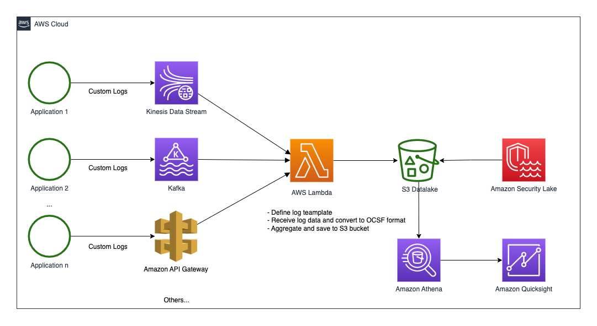

# Ingest your custom log from applications into AWS Security Lake

This is a Serverless Application Model project that aims to receive the logs from your custom sources and save them into the AWS Security Lake using the OCSF format.

## Architecture:


## Features:
- Define the structure of your log data and map to OCSF fields.
- Receive log data from a channel(requires trigger Lambda function support).
- Convert your log data to a standardized format based on your defined schema.
- Aggregate and save the logs into the Amazon Security Lake.

## Deployment:
- Create custom source for your application in the AWS Security Lake console..
- Modify the log definition file
  - Change the LogBucket, LogPath and field mappings.
  - Upload definition file to an S3 bucket. 
- Deploy the project to AWS
  - Open template.yaml and modify the IAM role, ARN and file path, etc.
  - Install nodejs dependency: 
    - ```npm install```
  - Use AWS SAM CLI or Cloud9 to deploy the project.
- Deploy the log collector(e.g.: Fluent-bit) on your server and set output to a supported channel(e.g., Kinesis Data Stream).

- Monitor the Lambda execution in AWS CloudWatch Logs.

## Example: Collecting Nginx access logs into AWS Security Lake
- Log definition sample: [log-schema-config.json](security-lake-custom-source-ingestion-lambda/config-example/log-schema-config.json)
- Deploy the Serverless Application Model to AWS
- Install Fluent-bit on a Nginx Server
- Configure Fluent-bit set ouput to a AWS Kinesis Data Stream

The OCSF specification: https://schema.ocsf.io/